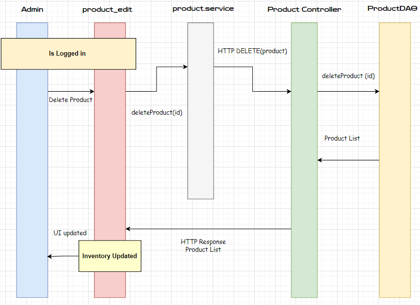
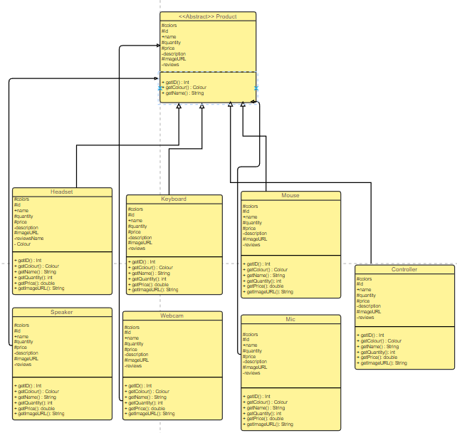

# PROJECT Design Documentation

## Team Information
* Team name: (404) Team Not Found
* Team members
  * Austyn W.
  * Miguel D.
  * Ryan Y.
  * Sherman Z.

## Executive Summary
This project is a Webstore to sell computer parts, more specifically high quality and customizeable keyboards and mice. Users are able to create an account and login to their account to view their shopping cart and purchase products. Users are also able to customize their products by selecting a color from a dropdown menu, post reviews for products that they have already purchased and they can also view other reviews for the product within that product's page. Admins are able to see a list of orders, manage their available inventory, and review custom orders.

### Purpose
A webstore for computer enthusiasts with an importance in customization and reviews.

### Glossary and Acronyms
| Term |     Definition     |
|------|--------------------|
| SPA  |     Single Page    |
| DAO  | Data Access Object |
| MVP  | Minimum Viable Product |

## Requirements
This section describes the features of the application.

The e-store should offer users a comprehensive range of features to enhance their shopping experience. They should be able to easily find the products they are interested in by browsing through a list of available products or by searching for a specific product. Once they have found the products they want, they should be able to add them to their shopping cart and checkout with ease. For returning customers, it should be possible to create an account and login to access previous orders and make the checkout process eaven quicker.

Additionally, users should be able to personalize their products by choosing a color from a dropdown menu, which will add a unique touch to their purchase. Customers should also be able to share their experiences with the products they have purchased by posting reviews. This feature will allow them to provide feedback and help other customers make informed purchasing decisions.

Admins should have access to a comprehensive dashboard where they can manage orders, track inventory levels, and review custom orders. They should be able to keep an eye on stock levels, ensuring that popular products are always available and customers can continue to purchase with confidence. By providing these features, the e-store can ensure that both customers and admins have a smooth and enjoyable experience.

### Definition of MVP
Our MVP is a simplified version of the e-store without customization or reviews.

### MVP Features
Top-Level Epics:
* Accounts
  * User should be able to create an account.
  * User cannout create an account with a pre-existing username
  * Users should be able to delete an account.
  * Users should be able to edit their details
  * Admins should be able to remove an account.
* Login
  * Users and Admins should be able to login into their own accounts.
  * Users and Admins cannot login again if they are already logged in.
* Logout
    * Users and Admins should be able to logout of their own accounts.
    * Users and Admins cannot logout if they are not logged in.
* Shopping Cart
  * Users should be able to add products to a cart.
  * Users should be able to remove products from a cart.
  * Users should be able to checkout a cart.
  * Users should be able to see the total price of their cart.
  * Users should be able to change the quantity of a product in their cart.
* Review
  * Users should be able to write a review about a product previously purchased
  * Users should be able to give it a star rating out of 5
* Products
  * Users should be able to see a list of products.
  * Users should be able to search for a product.
  * Users should be able to view a product's details.
  * Users should be able to view a product's average rating based on reviews
  * Admins should be able to add a product.
  * Admins should be able to remove a product.
  * Admins should be able to edit a product

### Enhancements
The first enhancement we have implemented in our MVP is the ability for users to customize their products, which we believe is a valuable addition to our platform.

To implement this enhancement, we have added a dropdown menu on the product page, allowing users to easily select their desired color. This feature is seamlessly integrated with the shopping cart, where the customized product will be displayed with the colour that was selected, providing a streamlined checkout process for our users.

The second enhancement we have added to our MVP is the ability for users to post and view reviews for products they have already purchased. We understand that customer reviews are a critical component of the purchasing decision-making process, and by providing this functionality, we have empowered our users to make informed choices. We decided to make it a requirement for the User to purchase a product before they could review it to remove reviews of User's who haven't even used the product.

Users can view reviews for products within the product page, giving them insight into the quality and usability of the product before making a purchase. They can add reviews through their "Purchase History", a tab that contains all items that were purchased through their shopping cart.

## Application Domain

This section describes the application domain.

Techasaurus is an e-store that provides customers with a range of products to browse and purchase. Our inventory includes various products that customers can search for and add to their shopping carts. To provide a personalized experience, we allow customers to select a color from a predefined set of colors for certain products.

Customers can create an account on our platform, which allows them to save their payment information and address, view their purchase history, and edit their personal details. This feature streamlines the checkout process, making it faster and more efficient. Customers can also log into their account to see their orders and track their delivery status.

To ensure the security of customer information, we require customers to have an account, with address and payment information, to make purchases. Each customer account is secured with a unique username and password. Admins also have an account, which allows them to moderate reviews, manage the inventory, and manage customer accounts.

Customers can create reviews for products they have already purchased, providing valuable feedback for other users. They can also view reviews left by other customers to help inform their purchasing decisions.

Overall, Techasaurus provides a seamless and personalized shopping experience for our customers, with a range of features designed to make their shopping journey as enjoyable and efficient as possible.

## Architecture and Design

This section describes the application architecture.

### Summary

The following Tiers/Layers model shows a high-level view of the webapp's architecture.

The e-store web application has been developed using the highly efficient Model-View-ViewModel (MVVM) architecture pattern.

The application's back-end is primarily driven by the Model section, which consists of a set of Java classes that define each item utilized in the application and the persistence, that contains the DAO (Data Access Object) Files. The classes in the Model section are core to the persistence which uses these classes for most of the functionality within our program.

The client-side of the e-store web application is a single-page application (SPA) built with Angular, incorporating HTML, CSS, and TypeScript to create an engaging user interface. The ViewModel acts as the mediator between the client-side View and the server-side Model, providing the necessary RESTful APIs to the View and managing any logic needed to handle the data objects from the Model.

Both the ViewModel and Model are built using Java and the Spring Framework. Details of the components within these tiers are provided below.

### Overview of User Interface

This section describes the web interface flow; this is how the user views and interacts with the e-store application.

Upon entering our website, the user is greeted by a dashboard that contains a grid of various products within our store. This grid of products contains an image for each product, their names, and the price of each product. Clicking a product within this grid will direct the user to a different page containing details on the product for the user to view. Along the bottom of this page are two buttons: "Add to Cart" and "Back". "Add to Cart" will add a product to the shopping cart, and a dialog box will appear notifying the user that the product has been added to their cart.

Along our header, we have various buttons. On the left-hand side, we have a "Dashboard" and "Products" button, and on the right side, we have a search bar, a shopping cart icon, and a login button. The "Products" button should only be accessible to an admin, but we do not have that implemented as of now. Upon clicking this button, the admin will be directed to a page containing an "Add Product" section with 3 fields (Name, Price, Quantity) and a list of all the products in the inventory. Clicking a product within this list will allow the admin to modify the product's name, price, and quantity. The next button along the header is the search bar. This will allow the user to input any string and display products with a similar name in a dropdown container for them to select.

The shopping cart icon directs the user to a different page containing the shopping cart. This page displays a list of products and their price. There is also a "Check Out" button at the bottom that will create a dialog box to let the user know that their transaction was successful, and it will clear the shopping cart.

The last item is the login button, which will direct the user to enter their username and password to log in. Upon entering the wrong password or the wrong username, a dialog box will notify the user. Successful login will direct the user back to the dashboard. Users can also create a new account by clicking on the "Sign Up" text located within the login page. This will redirect the user to a new page prompting them for their account info (Username, Password, First Name, Last Name, Address, and Payment Info). Upon clicking the "Sign Up" button, a dialog box will notify the user that their account has been created, and they will be redirected to the dashboard with their newly made account already logged in.

### View Tier

In the View Tier UI, it is first routed to a dashboard with multiple links to other route. From clicking on a product to view details or logging into an account, anything can be done with just a click. 

The dashboard is displaying the current list of products in the system with each one designed to be click to show its details. Each product contain color, product type, quantity, name, id, image, rating and price. 

Products can be added into the shopping cart once you are signed into the web store. The account session determies whether you have log in and are in a session. 

By adding a product in the cart, there will be a HTTP put request to update the shopping cart's product list. 

Users can also delete product from their cart as they will make a HTTP DELETE request to remove the product from their cart product list. 

While users have many features from logging in, to updating account info. Admin as well have features in the webstore. When they are logged in, they have the ability to manage products from the inventory. An example of this is by deleting a product with a request of HTTP DELETE. This will remove the product from the product list. 

Overall, the admin can also add/update products from inventory and remove user from the system as well. 

### ViewModel Tier

In this tier of our architecture, we have a set of Java classes that will handle any HTTP Request for either an Account or a Product. These requests are divided into the AccountController.java and the ProductController.java.

The Account Controller is repsonsible for handling all HTTP requests that relate to a user's account. This includes logging in, logging out, creating an account, and deleting an account. This will also include several other requests regarding a user's shopping cart(add, delete, remove, clear), payment info(add, update, delete), address info(add, update, delete), and their reviews(order history).

The Product Controller manages HTTP requests related to products, including adding, editing, and deleting products. It also handles requests for managing the product's attributes, such as reviews, quantity, price, name, image, description, and color.

### Model Tier

The image below displays a UML Diagram of our entire estore-api. 

A core class of the Model Tier is the Account class. The Account class is an abstract class responsible for storing a user's username and password. This class will call upon three core classes: AccountAuthentication, AccountSession, and ActiveAccountSessions. These classes are responsible for keeping track of multiple users that have logged in and validating that a specific user is logged into the system.

The Payment class will contain information on the user's payment info such as the name of the cardholder, the card number, the security code, and the expiration date.
The Address class will hold parts of the user's address information (street, house number, and zip) with methods to access the information as well.

In addition, the Shopping Cart class will store a list of Product objects. There will also be methods to add or remove Products from this list. 

The Product class will be responsible for storing information on the Product such as its price, quantity, color, and name. The color will be represented by a Color object.
This Color class will only hold the name of a color to allow for custom colors in the future.

Our e-store will have seven main products, which are Headests, Keyboard, Mouse, Speaker, Webcam, Mic, Controller. Since Product is an abstract class, these classes will extend the Product class and add other methods if needed. These classes will be differentiated by through a label called ProductType.

## OO Design Principles
Throughout our code we have implemented many OO Design Principles that we have learned throughout the course. The following principles include: Pure Fabrication, Single Responsibility, Loose Coupling, Open/Closed.

Pure Fabrication is present within our design in the form of Account Authentication and ActiveAccountSessions since these classes are not directly related to Account, but instead are present in order to help with keeping track of who is logged in. For example, in the Account Authentication class is used to validate an account based on the account session and account parameters provided In addition, the class is not directly related to the core functionality of our API, but rather a utility class. Pure Fabrication help prevent a class from taking on too many responsibilities, thus making it easier to maintain and test. In addition, it also allows for the code to be called in other instances if needed rather than having to rewrite the code.

Single Responsibility is present within our code through the use of various controller classes and regular classes that serve one focal purpose. For example, the Account Controller is responsible for handling HTTP Requests related to the Account class. This includes creating a new account, logging in, and logging out. In addition, it relies on the AccountDAO class to handle the database operations. By adhering to this principle, we are able to keep our code organized, allows for easy maintanance, and allows for easy testing.

Loose Coupling is present within our code through the use of interfaces. For example, the AccountDAO interface is used to define the methods that will be used to interact with the database. This allows for the AccountFileDAO class to implement the AccountDAO interface and override the methods which can be used in other instances if needed. In addition, it allows for the AccountFileDAO class to be easily tested since it is not directly interacting with the database.

Open/Closed is present within our code through the use of abstract classes. For example, the Product class is an abstract class that is extended by the Keyboard and Mouse classes. This allows for the Product class to be easily extended in the future if needed. In addition, it allows for the Product class to be easily tested since it is not directly interacting with the database.

## Static Code Analysis/Future Design Improvements

Initially, the code had multiple bugs and errors, but the team persevered and resolved all the issues. The primary bugs in the UI were related to Angular syntax, requiring the team to consult various resources including Angular documentation. The team also utilized SonarQube to identify and address errors. Meanwhile, the bugs within the UI were related to code within the Unit Tests specifically regarding the fields within many of the Assert statements. After refactoring our code, we now have a clean code base with no bugs or errors, as shown in the screenshot below.

Some future 

## Testing

Our Testing was mainly done through JUnit Tests and JaCoco. We have a total of 20 JUnit Tests that test the functionality of our API. These tests are located in the test folder of our project and are seperated based on the Architecture they occupy(Controller, Model, Persistence, API).

### Acceptance Testing

Most of the user stories for Sprint 2 passes their accpetance criteria tests. However, we have failed to completely implement the Logout story within our project. In addition, the Account story is partially done as we have fully implemented the feature into our Angular UI. We currently have all our stories for Sprint 2(10 stories) marked as completed due to the fact that we did not create their acceptance criteria with Angular in mind. In reality we should have 17 user stories completed and 3 non completed.

For sprint 4, all user stories that is deemed a priority has been completed and passed. There is currently no failures but there are some minor stories that can be done. 

### Unit Testing and Code Coverage

This is our total code coverage for our estore-api component with our code. An interesting thing to note is that the tests for the persistence classes had the lower amount of coverage. This was mainly due to the presence of the abstract Account class which made it hard to test some aspects of our code since there weren't any direct methods that could be called for testing.

In addition, the Shopping Cart class within the Model tier had low coverage because of nested conditions within loops. This made it hard to test since we would have to create a large amount of products in order to test the code.

Meanwhile, the Controller classes and the EstoreApi did fairly well. It is important to note that the EstoreApi class had low coverage because it does not contain any tests.

